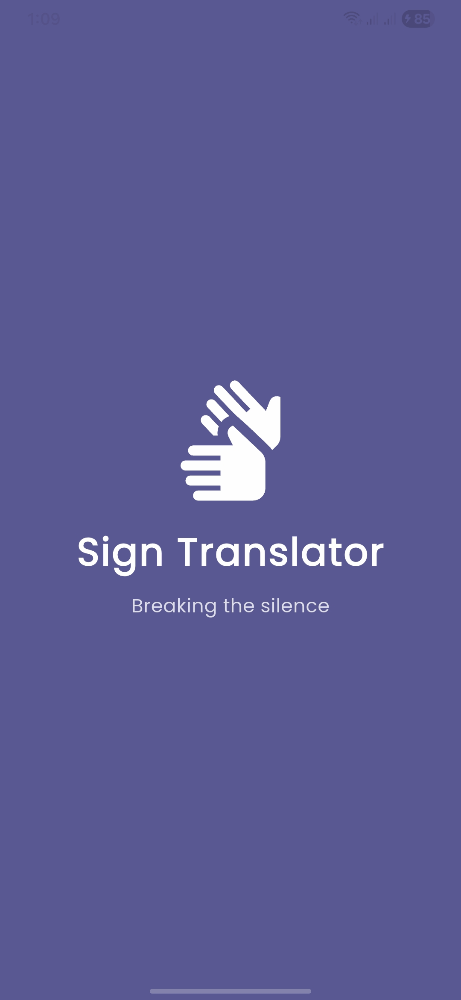
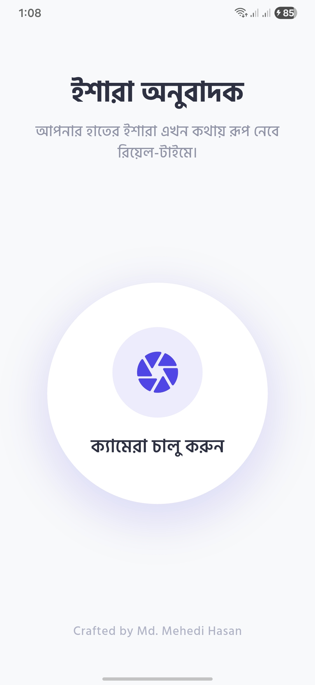
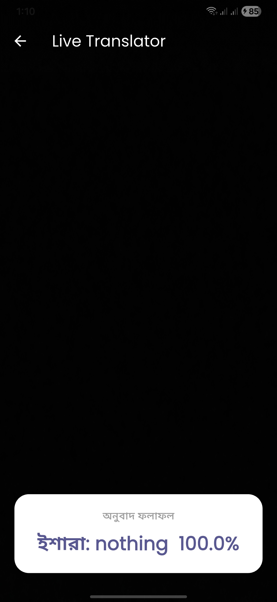

# Sign Language Translator BD

A real-time sign language to text translator mobile application designed to bridge the communication gap. Built specifically for offline, on-device processing.

## Screenshots

  
   
  

## Features
* **Real-Time Tracking:** Converts hand gestures to text instantly using the live camera feed.
* **On-Device ML:** Powered by TensorFlow Lite, ensuring fast offline processing without needing external API calls.
* **Custom Image Processing:** Efficiently converts YUV420 camera frames to RGB matrix for ML model input.
* **Modern UI/UX:** Clean, intuitive, and premium dashboard with Bengali typography.

## Tech Stack
* **Framework:** Flutter
* **Machine Learning:** TensorFlow Lite (`tflite_flutter`)
* **Core Packages:** `camera`, `image`, `permission_handler`
* **Typography:** Google Fonts (Hind Siliguri)

## How to Run Locally
1. Clone this repository: `https://github.com/mehedixlab/sign-language-translator-bd.git`
2. Navigate to the project directory: `cd sign_language_translator`
3. Get the dependencies: `flutter pub get`
4. Run the app on a physical device: `flutter run`
*(Note: Camera features might not work properly on an emulator)*

## Developed By
**Md. Mehedi Hasan**